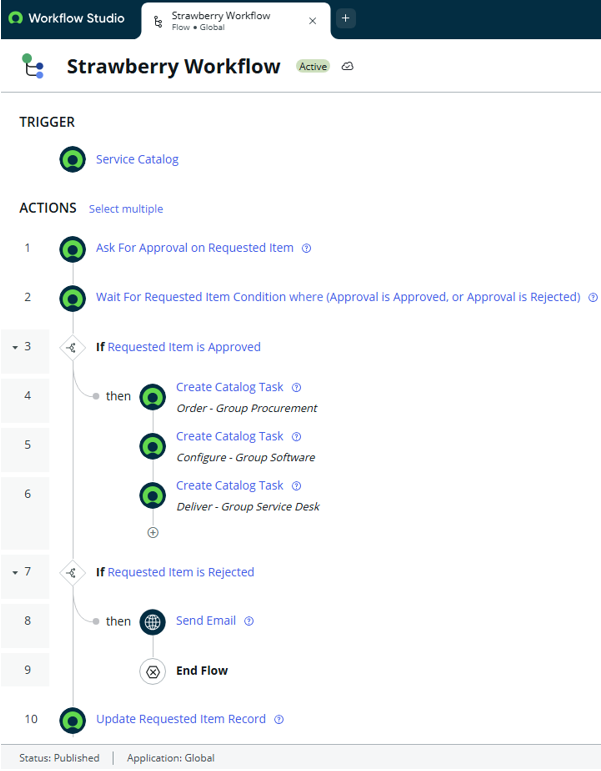
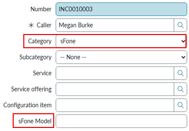
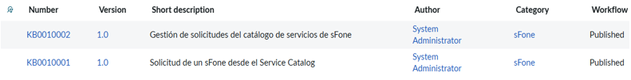
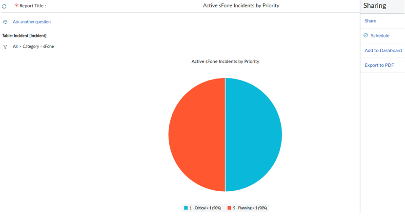

# ServiceNow Administration Capstone Project

Proyecto práctico realizado en una **ServiceNow Personal Developer Instance (PDI)** como parte del módulo Capstone Project del curso **ServiceNow Administration Fundamentals**.

El objetivo del proyecto es aplicar de forma práctica conocimientos de administración, configuración y automatización dentro de la plataforma ServiceNow.

## Áreas trabajadas

- Incident Management
- User Administration
- Service Catalog
- Workflow Studio
- Knowledge Management
- Services & Service Offerings
- Email Notifications
- Visualizations & Scheduled Reports

## Principales conocimientos aplicados

- Configuración de formularios, campos y vistas.
- Gestión de usuarios, grupos y roles.
- Automatización de solicitudes mediante Flows.
- Uso de Triggers, Actions, Conditions y Data Pills.
- Creación y asignación de Catalog Tasks.
- Gestión de Knowledge Bases y Knowledge Articles.
- Configuración de Services y Service Offerings.
- Creación de notificaciones automáticas.
- Creación y programación de visualizaciones.

## 🖥️ Vista del proyecto

A continuación se muestran algunas de las principales configuraciones realizadas durante el Capstone Project.

### ⚙️ Automatización con Workflow Studio

Se desarrolló el flujo **Strawberry Workflow** para automatizar el proceso de solicitud de un dispositivo, incluyendo aprobación, lógica condicional, creación de Catalog Tasks y actualización del Requested Item.

### 🎫 Incident Management

Se personalizó el formulario de Incident mediante nuevos campos, vistas y opciones de categorización.

### 📚 Knowledge Management

Se configuró una categoría específica dentro de la Knowledge Base y se crearon artículos dirigidos tanto a solicitantes como a usuarios encargados de gestionar las solicitudes.

### 📊 Visualización y reporting

Se creó una visualización de incidencias activas de sFone agrupadas por prioridad y se programó su envío automático al grupo de soporte.

## ✅ Qué he aprendido

Este proyecto me ha permitido reforzar conocimientos de administración, configuración y automatización en ServiceNow. He trabajado con personalización de formularios, gestión de usuarios y roles, automatización de solicitudes mediante Flows, creación de tareas de catálogo, gestión de Knowledge Bases, asignación automática de incidencias, notificaciones y reporting programado.

## 📄 Documentación completa

Puedes consultar la documentación completa del proyecto, incluyendo el desarrollo, las verificaciones y las conclusiones:

➡️ [Ver ServiceNow Capstone Project completo](documentation/ServiceNow-Capstone-Project.pdf)

## Entorno

- ServiceNow Personal Developer Instance (PDI)
- ServiceNow Administration Fundamentals
- Capstone Project
